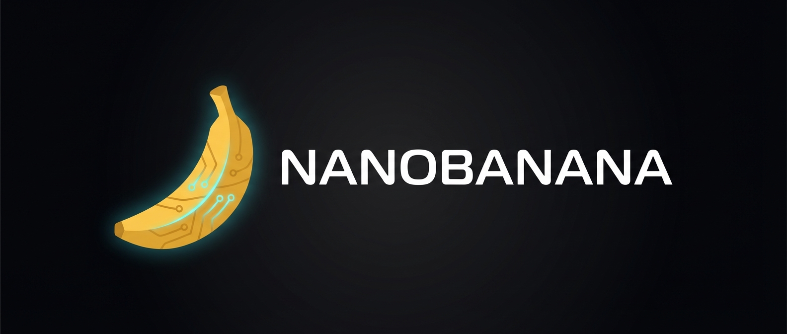

<p align="center">
  
</p>

# Nanobanana

A Claude Code skill for generating images with Gemini 3 Pro Image (Nano Banana Pro).

The skill automatically transforms your requests into optimized prompts that exploit Nano Banana Pro's best features: perfect text rendering, logical reasoning for infographics, and photorealistic consistency.

## Quick Install

```bash
curl -sL https://raw.githubusercontent.com/johnpsasser/nanobanana/main/install.sh | bash
```

Then set your API key:

1. Get one at [Google AI Studio](https://aistudio.google.com/apikey)
2. Add to your shell config:
   ```bash
   export GEMINI_API_KEY="your-key-here"
   ```
3. Restart Claude Code

## Usage

Just ask Claude Code to generate images. The skill activates automatically.

**Simple:**
```
Generate an image of a fluffy cat on a cloud
```

**Infographic:**
```
Create a diagram showing how an espresso machine works
```

**Poster with text:**
```
Make a poster for a jazz night called "Blue Moon" on Friday
```

**Portrait:**
```
Portrait of a woman with freckles and green eyes, wearing headphones
```

## What Makes It Good

Nano Banana Pro is a reasoning-based model. It does best with natural language descriptions, not keyword soup. This skill handles the translation:

- Detects the type of image you want (infographic, typography, portrait, general)
- Builds a structured prompt with subject, environment, specific text, style, and technical parameters
- Adds photography or illustration details that match the request

The model is particularly good at rendering text in images. If your image needs signage, labels, or titles, just describe what the text should say.

## Manual Installation

If you prefer not to run the install script:

1. Create the skill directory:
   ```bash
   mkdir -p ~/.claude/skills/nanobanana/scripts
   ```

2. Copy the files:
   ```bash
   curl -sL https://raw.githubusercontent.com/johnpsasser/nanobanana/main/SKILL.md \
     -o ~/.claude/skills/nanobanana/SKILL.md
   curl -sL https://raw.githubusercontent.com/johnpsasser/nanobanana/main/scripts/generate.py \
     -o ~/.claude/skills/nanobanana/scripts/generate.py
   ```

3. Install the dependency:
   ```bash
   pip install google-genai
   ```

4. Set your API key (see above)

5. Restart Claude Code

## How It Works

1. You describe what you want
2. The skill analyzes your request and picks a pattern (infographic, typography, character, or general)
3. It builds an enhanced prompt with all the details Nano Banana Pro needs
4. The image generates and saves to your current directory

Images are saved as `nanobanana_YYYYMMDD_HHMMSS.png`.

## Troubleshooting

**"GEMINI_API_KEY not set"**

Make sure it's exported in your shell. Check with `echo $GEMINI_API_KEY`. If it's empty, add it to your `.zshrc` or `.bashrc` and restart your terminal.

**"google-genai not installed"**

Run `pip install google-genai`. If you have multiple Python versions, make sure you're installing to the right one.

**API errors**

Check that your key is valid at [Google AI Studio](https://aistudio.google.com/apikey). Free tier has usage limits.

## Links

- [Gemini API Image Generation Docs](https://ai.google.dev/gemini-api/docs/image-generation)
- [Nano Banana Pro Documentation](https://ai.google.dev/gemini-api/docs/nanobanana)
- [Nano Banana Hackathon Kit](https://github.com/google-gemini/nano-banana-hackathon-kit)

## License

MIT. Do whatever you want with it.
